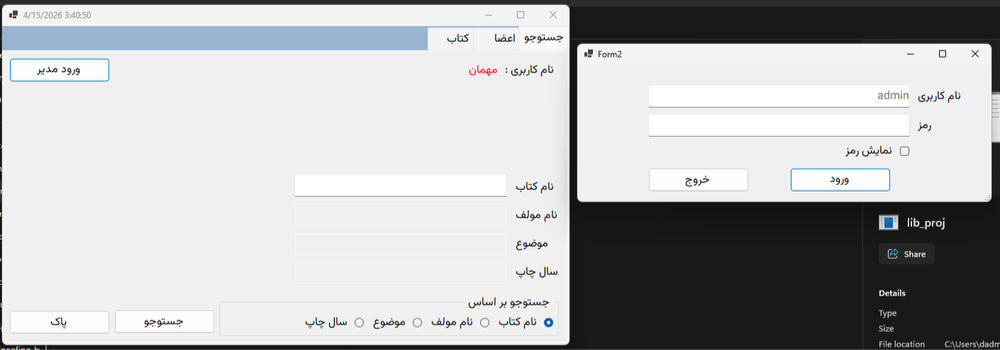

## Library Panel (Windows Forms)

A **C# Windows Forms** desktop application built with **.NET 6 (net6.0-windows)** as a school exam project.

The app acts as a small **library panel** that focuses on quick day‑to‑day interactions:
- **Search & lookup**: find books using different search criteria (for example by title/author/subject/year, depending on your UI options).
- **Book information view**: display key metadata like book name, author, subject, and publish year.
- **Simple authentication**: a login form (e.g., an *admin* user) that enables access to privileged actions.
- **Arabic RTL UI**: the interface is designed for **Arabic right‑to‑left** layout, aiming for clear labels and a straightforward workflow.

Overall, the project is a practical WinForms exercise that demonstrates building a multi-form desktop UI, collecting user input through common controls (textboxes, radio buttons, buttons), and structuring a basic “panel” experience for managing and searching a small library dataset.

### Screenshot



### Tech stack
- **C#**
- **.NET 6**
- **Windows Forms**

### Requirements
- Windows 10/11
- Visual Studio 2022 (recommended) with the **.NET Desktop Development** workload
- .NET 6 SDK (if you prefer building via CLI)

### Run (Visual Studio)
- Open the solution/project in Visual Studio
- Set the WinForms project as Startup Project (if needed)
- Press **F5** to run

### Run (CLI)
From the repo root:

```bash
dotnet restore
dotnet build
dotnet run --project lib_proj/lib_proj.csproj